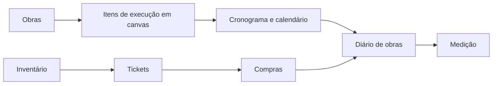
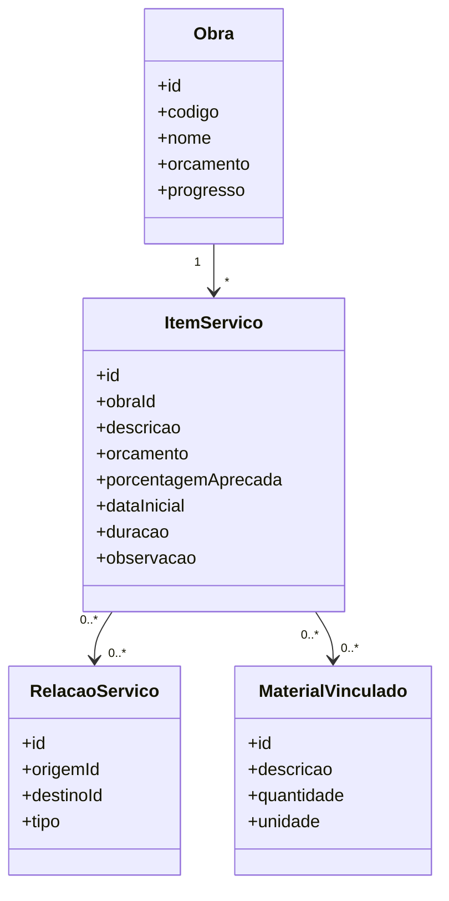
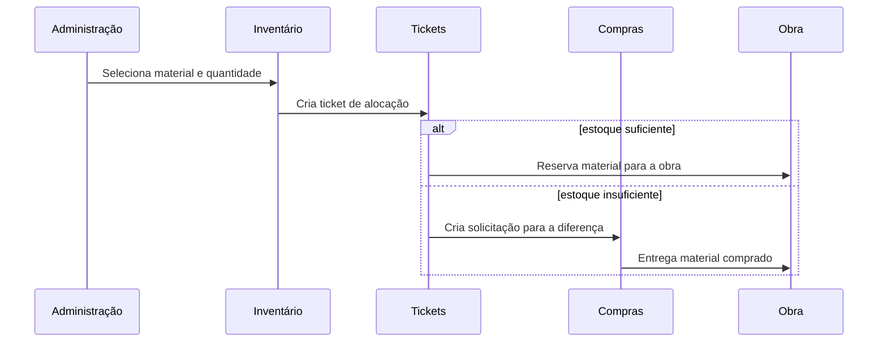
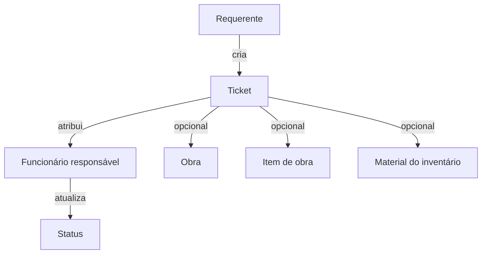
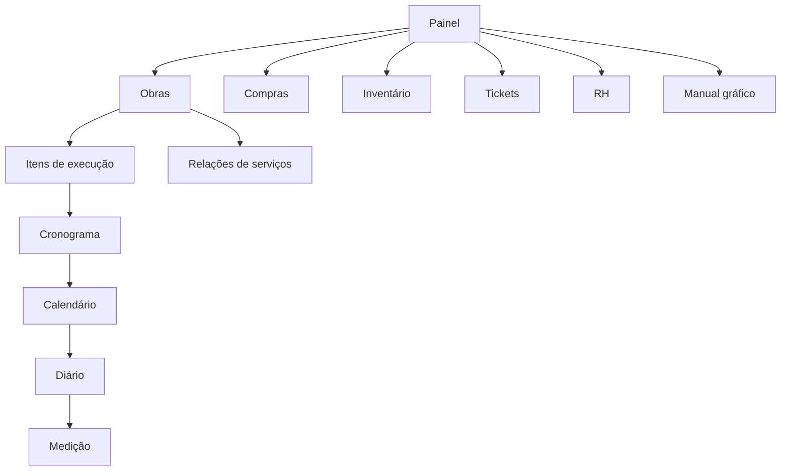

# Arquitetura computacional do MacroObras

## Fluxo geral

## Serviços de obra

As relações entre itens não são geradas automaticamente.

## Inventário, ticket e compra

A compra pode ser administrativa e não precisa possuir item de obra.

## Tickets

## Sitemap

## Persistência atual

Os modelos gráficos, inventário e tickets são persistidos no armazenamento
local da estação. O ciclo seguinte deve mover esses registros para RPCs do
backend Nim.
